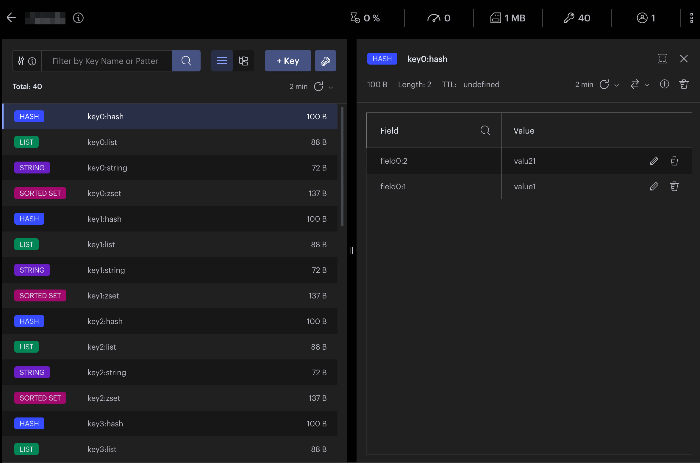

# R/O Store

A common pattern for dynamic languages like php and python is to use a standalone high-performant store for runtime config, because this is common way to share a state. 

Frequent choices are KV stores like memcached, Redis(r), Aerospike(r)

On the other hand, a common pattern for high-performant projects written in languages like Go, C/C++, Java is to keep config available to all nodes as a single file, disseminate the file to all nodes, and make them read it into memory. Which works well until the size of config grows to a level where incremental updates become a nessesity).

This project is a take at creating a Redis(r) - compatible store, that is capable of making avaialbe, as a Redis(r) database a large jsonl file.

This simple service enables following:
* We can dissiminate configs as gzipped json (optionally, with an index)
* We can make R/O Store to read a new config very fast and atomicaly (really, if there's an index, only index w/o values is read on store load)
* When we mess up, we can rollback painlessly, just specifying the old config files, and very, very fast!
* We can access our config data using any Redis(r) client (redis-py, redisgo, etc..) and some subset of the Redis(r) api
* It doesn't necessarily need to be config data. We can dissiminate Features, and have a Feature store up and ready in no time

## Some technical details
Data is stored in jsonl format (single json object per line). Currently it only works with new line "\n" separator. 
An index file can be stored nearby, it can speed up load (it contains basic info like key name, offet in records file, length of a records, type of a rocord). If you are having large hashsets, that'll save a lot of memory. (And if you have a small dataset, the records file will be cached in memory by OS anyway, so there won't be any difference for small files).

Config is re-read every few seconds (5 by default). If it lastModified time changed, the new store will be loaded with record, and index files. 

## Mock dataset in one of Redis(r) clients

